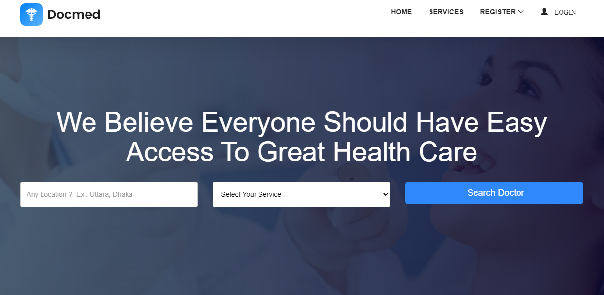
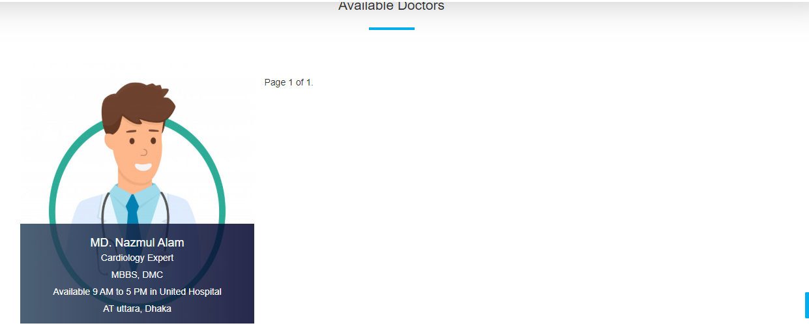
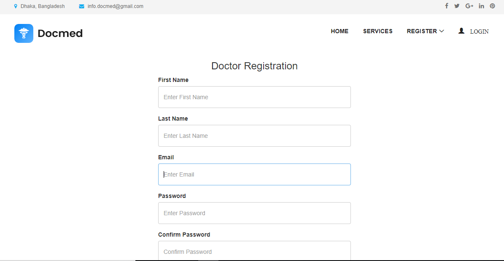
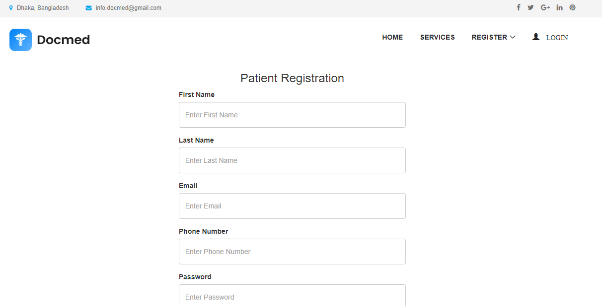

# mediconnect / django-doctor-appointment

Finding the right doctor based on specialization, location, and patient experience is often difficult for many individuals. Patients usually depend on word-of-mouth recommendations, which may be unreliable or limited. Additionally, most clinics still follow a manual appointment process, causing long waiting times and miscommunication.

Doctor appointment application using Django.

Live : [Demo](https://docmed-11.herokuapp.com/)

DATABASE
- Local : SQLite
- Live : PostgreSQL

## Screen Shots

### Search Doctor

### Doctor Registration

### Patient Registration

>>>>>>> 8fdb83132c8bafe32cfacb8699755c496c696d48
